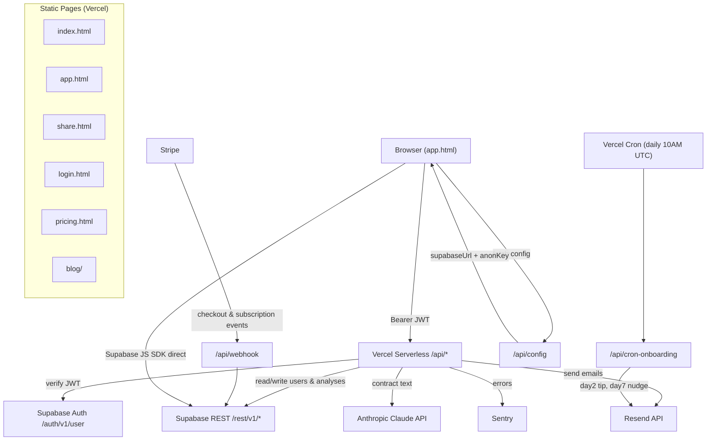
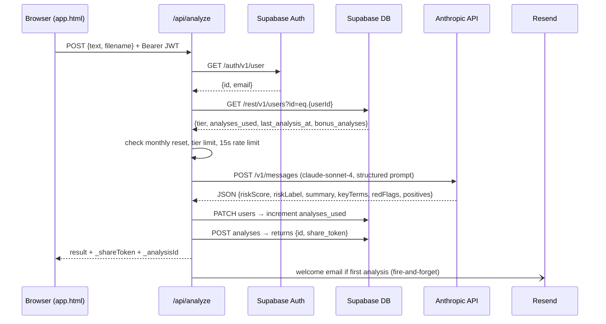

# ClauseGuard — CLAUDE.md

## Project Overview

ClauseGuard is a SaaS contract analysis tool targeting freelancers and small businesses. Users paste or upload contract text; the app calls the Anthropic Claude API to return a risk score (0–100), red flags with negotiation suggestions, key terms, and positives. It runs as a no-build-step static frontend (vanilla HTML/CSS/JS) deployed on Vercel, backed by Vercel serverless functions in `/api`, Supabase for auth and storage (via raw REST, no SDK), Stripe for subscriptions, Resend for transactional email, Sentry for error tracking, and PostHog for analytics. A separate autonomous AI agent OS lives in `/agents`.

---

## Architecture Diagram



---

## Directory Structure

```
clauseguard/
├── api/                    # Vercel serverless functions (one file = one route)
│   ├── _email.js           # Shared: Resend email sending + all email templates
│   ├── _sentry.js          # Shared: Sentry init + re-export
│   ├── analyze.js          # Core: auth, tier enforcement, Claude call, save result
│   ├── config.js           # Public: returns supabaseUrl + anonKey to browser
│   ├── cron-onboarding.js  # Cron: day-2 tip + day-7 upgrade nudge emails
│   ├── delete-account.js   # Deletes auth user + all data
│   ├── export-data.js      # GDPR data export
│   ├── generate-share.js   # Mints a fresh share_token UUID for an analysis
│   ├── lead.js             # Saves leads from landing page CTA
│   ├── portal.js           # Stripe billing portal redirect
│   ├── referral-activate.js# Validates referral code, credits both parties
│   ├── revoke-share.js     # Nulls out share_token
│   ├── share.js            # Public: fetch analysis by share_token
│   └── webhook.js          # Stripe webhook: checkout, sub updated/deleted
│
├── agents/                 # Autonomous AI agent OS (not part of the web app)
│   ├── README.md           # Agent roster, tool stack, Slack channels, Notion DBs
│   ├── roles/              # One charter per agent (CTO, CMO, SDR, etc.)
│   ├── playbooks/          # Step-by-step procedures
│   ├── prompts/            # Agent instantiation prompts
│   ├── templates/          # SDR / Customer Voice reply templates
│   ├── hitl.md             # Human-in-the-loop checkpoints
│   ├── kpis.md             # KPI definitions and anomaly thresholds
│   ├── integrations.md     # Tool usage rules per agent
│   └── schedules.md        # Canonical cron schedule table
│
├── tests/                  # Playwright E2E tests (run against production)
│   ├── analysis.spec.js    # Core analyze flow
│   ├── api.spec.js         # API auth boundary + response contract tests
│   ├── app.spec.js         # App UI smoke tests
│   ├── auth.spec.js        # Login / signup flows
│   ├── file-upload.spec.js # PDF/DOCX upload
│   ├── landing.spec.js     # Landing page
│   ├── referral.spec.js    # Referral program
│   ├── share.spec.js       # Share link create/revoke/re-enable
│   └── fixtures/           # Test fixture files
│
├── blog/                   # Static HTML blog articles
├── index.html              # Landing page
├── app.html                # Main SPA (auth gate, upload, results, history)
├── share.html              # Public share page (reads by share_token)
├── login.html              # Auth page (Supabase JS SDK)
├── pricing.html            # Pricing page
├── vercel.json             # Route rewrites + Vercel cron config
├── playwright.config.js    # Test config (baseURL = production)
└── package.json            # Only dependencies: @playwright/test, dotenv, @sentry/node
```

---

## Key Conventions

- **No build step.** All frontend is plain HTML/CSS/JS — no bundler, no framework, no TypeScript. What you write is what ships.
- **One file = one API route.** Vercel maps `/api/foo.js` → `GET|POST /api/foo`. Method enforcement is manual inside each handler.
- **Auth is copy-pasted, not shared.** Every authenticated handler independently fetches `${SUPABASE_URL}/auth/v1/user` with the Bearer token. There is no middleware or shared auth utility.
- **Supabase via raw `fetch`, not SDK.** All DB reads/writes use the Supabase REST API with the service role key. No Supabase JS client in the backend. The browser uses the Supabase JS SDK (loaded from CDN) directly for auth session management and some reads.
- **Shared utilities are prefixed with `_`.** `_email.js` and `_sentry.js` are the only shared modules. Everything else is standalone.
- **Errors: fail fast with JSON.** Handlers return `res.status(4xx/5xx).json({ error: '...' })` immediately on any problem. No centralized error handler.
- **Sentry only in `analyze.js` and `webhook.js`.** Not all handlers import Sentry — only the two most critical ones.
- **Subscription tiers:** `free` (3/mo), `starter` (10/mo), `pro` (50/mo), `team` (∞). `bonus_analyses` is additive on top of tier limit. Monthly reset is enforced inline in `analyze.js` only.
- **`share_token` is a DB-generated UUID default** on the `analyses` table. The backend never generates it on insert — it reads back `saved[0].share_token` from `Prefer: return=representation`. `generate-share.js` uses `crypto.randomUUID()` to set a new one after revoke.
- **Playwright tests run against `https://www.clauseguard.io` (production).** There is no staging environment. Authenticated tests require `TEST_EMAIL`/`TEST_PASSWORD` in `.env.test` and skip silently if absent.
- **Cron protection:** `cron-onboarding.js` validates `Authorization: Bearer ${CRON_SECRET}` — Vercel injects this header automatically for cron invocations.

---

## Data Flow

### Contract analysis (happy path)



### Stripe subscription upgrade

```
Stripe checkout → /api/webhook (sig verified)
  → getSubscriptionPriceId → map priceId → tier
  → lookupUserByEmail in Supabase
    → found: PATCH users {subscription_tier, analyses_used: 0, analyses_reset_date}
    → not found: INSERT pending_subscriptions (best-effort; no retry)
```

---

## Dependencies & Integrations

| Service / Library | Purpose |
|---|---|
| **Anthropic Claude API** (`claude-sonnet-4-20250514`) | Contract analysis — single prompt, JSON output, 12k char input cap |
| **Supabase** | Auth (JWT issuance + verification) + Postgres DB via REST API |
| **Stripe** | Subscription checkout, billing portal, webhook events for tier sync |
| **Resend** | Transactional email (welcome, day-2 tip, day-7 upgrade, referral notify) |
| **Sentry** (`@sentry/node`) | Exception capture in `analyze.js` and `webhook.js` |
| **PostHog** | Browser-side analytics (page views, analysis events, share/revoke events) |
| **Vercel** | Static hosting + serverless functions + cron jobs |
| **Playwright** (`@playwright/test`) | E2E test suite against production |
| **dotenv** | Loads `.env.test` for Playwright test credentials |

**Environment variables required:**
- `SUPABASE_URL`, `SUPABASE_ANON_KEY`, `SUPABASE_SERVICE_ROLE_KEY`
- `ANTHROPIC_API_KEY`
- `STRIPE_SECRET_KEY`, `STRIPE_WEBHOOK_SECRET`
- `STRIPE_PRICE_STARTER`, `STRIPE_PRICE_STARTER_ANNUAL`, `STRIPE_PRICE_PRO`, `STRIPE_PRICE_PRO_ANNUAL`, `STRIPE_PRICE_TEAM`, `STRIPE_PRICE_TEAM_ANNUAL`
- `RESEND_API_KEY`
- `SENTRY_DSN` (optional — Sentry silently skips if absent)
- `CRON_SECRET` (Vercel injects automatically for cron routes)

---

## Audit Notes

### Technical debt

- **No shared auth middleware.** The JWT verification fetch (`/auth/v1/user`) is duplicated verbatim in `analyze.js`, `delete-account.js`, `export-data.js`, `generate-share.js`, `lead.js`, `portal.js`, `referral-activate.js`, and `revoke-share.js`. Any change to auth (e.g. adding org-level checks) must be applied to every file.
- **Monthly reset lives only in `analyze.js`.** If usage is ever checked from another endpoint, it won't reset. This is an implicit coupling.
- **`pending_subscriptions` has no retry.** If a user pays before their account exists in `users`, their tier is saved to `pending_subscriptions`. There is no job that polls this table and applies the tier once the user record appears. This is a silent revenue / access bug if the account creation trigger fails.
- **Tests run against production.** There is no preview/staging environment. Running the full suite creates real analyses on real accounts and fires real emails. The test user must be a dedicated test account.
- **12,000-character input truncation** in `analyze.js` is hardcoded with no warning to the user if their contract is longer.
- **Blog is fully static HTML.** Adding a blog post requires manually writing HTML and updating `sitemap.xml` and `vercel.json`. No CMS.

### Inconsistent patterns

- `analyze.js` imports `_sentry.js`; `webhook.js` also imports it; other handlers don't — errors in those handlers are silently swallowed.
- `api/share.js` is a GET handler (reads public analysis by token); all other handlers are POST. Easy to confuse.
- `app.html` fetches Supabase config from `/api/config` on load, then initializes the Supabase JS SDK. This adds a waterfall request before the user can do anything. The anon key could be inlined.
- `generate-share.js` uses `crypto.randomUUID()` (Node built-in); `analyze.js` uses `randomBytes` from `crypto` for referral codes — inconsistent UUID generation approach.

### Areas to be cautious around

- **`api/webhook.js`** — Stripe signature verification is hand-rolled (not using the official Stripe SDK). Works correctly but is fragile; don't touch the HMAC logic without careful testing.
- **`app.html`** — ~1300 lines of inline JavaScript. All app state (`currentSession`, `currentShareToken`, `currentAnalysisId`, `lastResult`, `historyCache`) is module-level. No framework, no reactivity — UI state and DOM manipulation are tightly coupled.
- **Supabase RLS** — The backend bypasses Row Level Security entirely (service role key). All access control is enforced in application code. If a handler has a bug in its `user_id` filter, it could expose other users' data.

---

## Audit Instructions

For future Claude sessions auditing this repo:

**Start with these files — they define almost everything:**
1. `api/analyze.js` — the core product logic, tier enforcement, and DB schema is implied here
2. `api/webhook.js` — the full Stripe subscription lifecycle
3. `app.html` — all frontend state, UI flow, and API call patterns
4. `api/_email.js` — all email touchpoints and their triggers
5. `agents/README.md` — the autonomous agent OS (separate concern from the web app)

**Skip without reading:**
- `node_modules/` — never
- `package-lock.json` — irrelevant
- `blog/*.html` — pure marketing content, no logic
- `tests/fixtures/` — test data files
- `sitemap.xml`, `robots.txt` — static SEO files

**What "good" looks like here:**
- API handlers that follow the pattern: method check → auth → load user → business logic → DB write → response
- Frontend changes that update both the DOM state and the relevant `current*` variables in `app.html`
- New share/access features that respect the `user_id` ownership check on all DB mutations
- New Playwright tests that gracefully skip when `TEST_EMAIL`/`TEST_PASSWORD` are absent (for unauthenticated tests, no skip needed)
- Email sends are always fire-and-forget (`.catch(() => {})`) — never block the response on email delivery
